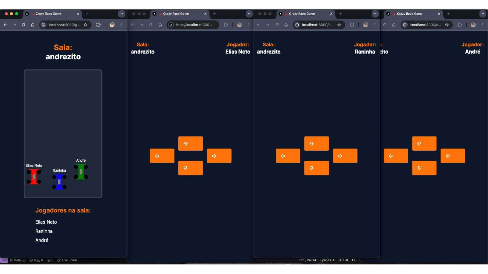
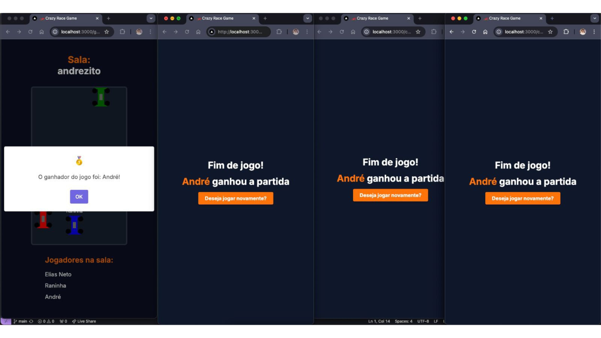

<h1 align="center">
  Crazy Race Game 🏎️
</h1>

## 👨🏻‍💻 About

Here is the front-end of a multiplayer racing game where players control Formula 1 cars. The goal of the game is to reach the finish line before the other players. The concept of this game is similar to Kahoot, with rooms and multiple players.

→ Check the API repository [clicking here](https://github.com/eliasacneto/api-crazy-race)<br/>

## Technologies Used

- React
- Socket.IO-client
- HTML5 Canvas
- Tailwind CSS

## ⚙️ How to Run the Application:

You will need to have [Node.js](https://nodejs.org/en) installed to use npm commands and [Git](https://git-scm.com/) installed on your machine.

Clone the project:

```bash
  git clone https://github.com/eliasacneto/crazy-race-game.git
```

Navigate to the project directory:

```bash
  cd crazy-race-game
```

Install the dependencies:

```bash
  npm install
```

Start the server:

```bash
  npm run dev
```

## 🖥️ Screenshots:

<div align="center" style="display: flex; flex-direction: column; gap: 1px;">
  
    
</div>
